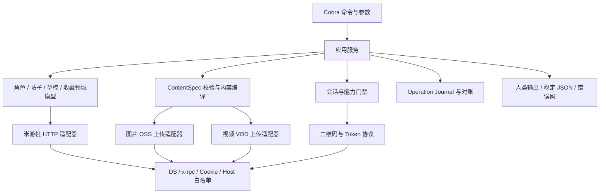

# miyoushe-cli 总体架构

状态：设计基线（功能实现仍受协议证据门禁约束）

文档状态：

| 文档 | 状态 | 含义 |
|---|---|---|
| 本文 | 设计基线 | 固定总体边界、原则、模块和交付顺序 |
| [认证设计](authentication.md) | 设计基线 | 行为与安全契约已确定，线上协议仍需按证据验收 |
| [社区功能设计](community-features.md) | 设计基线 | 目标命令与领域模型已确定，各写适配器按 V/O/P 和 fixture 独立门禁 |
| [协议证据清单](evidence-manifest.md) | 可更新清单 | 固定上游快照及证据成熟度；不会自动改变设计决策 |

## 1. 目标

构建一个可在 Windows、macOS 和 Linux 使用的米游社社区 CLI。它以 Go 单二进制分发，通过 Cobra 提供稳定命令树，覆盖：

- 米游社 App 扫码登录与本地凭据保存。
- 查看绑定角色、自己的帖子、帖子详情和收藏内容。
- 创建、查看、发布和删除草稿。
- 发布纯文字、图文、长文和视频内容。
- 在协议证据充分后提供帖子编辑、删除、收藏和取消收藏。

该工具面向用户主动操作，不用于批量养号、定时群发、风控绕过或无人值守的大规模写入。

## 2. 架构原则

1. **协议证据优先**：接口路径存在不等于请求契约完整。写适配器必须有脱敏 fixture 和契约测试才可启用。
2. **显式写入**：真实写操作必须来自用户明确命令；查看、验证和 dry-run 不产生内容或上传凭据。
3. **结果未知不重试**：发布、编辑或删除响应不完整时保留未决状态，先只读对账，避免重复写入。
4. **秘密最小暴露**：凭据仅在需要的内存边界中使用，不进入输出、日志、operation journal 或 fixture。
5. **领域与协议分离**：Cobra、业务规则、内容模型和 HTTP/上传协议各自独立，避免接口变化污染命令层。
6. **跨平台一致**：命令、ContentSpec 和 JSON 输出跨平台相同；平台差异只封装在文件权限、锁和路径处理层。

## 3. 逻辑分层



依赖只能自上而下指向接口或领域类型：

- Cobra 不直接拼请求 body。
- HTTP 适配器不读取命令行参数。
- 内容编译器不发网络请求。
- session 不持久化派生 Cookie。
- output 不接收未脱敏的上游响应。

## 4. 模块边界

| 模块 | 职责 | 不负责 |
|---|---|---|
| `cli` | 命令树、flags、依赖注入、退出码 | 业务规则、HTTP 细节 |
| `api` | 有界响应读取、retcode、超时、重定向和脱敏错误 | 具体领域语义 |
| `protocol` | App 版本、DS、公共 x-rpc 头、Cookie 和 host 白名单 | Token 生命周期决策 |
| `auth/session` | 扫码状态机、SToken 保存、会话派生和能力检查 | 帖子内容编译 |
| `role/post/draft/favorite` | 领域服务与上游适配器 | Cobra 输出格式 |
| `content` | ContentSpec、验证、legacy/Quill/HTML 确定性编译 | 上传和发布 |
| `media/image` | 图片摘要、上传参数和 OSS 上传 | 帖子 body |
| `media/video` | 探测、秒传、VOD 上传、登记、封面和 checkpoint | 自动删除孤儿媒体 |
| `operation` | 写操作记录、防重复、恢复和只读对账 | 保存任何秘密 |
| `output` | 稳定 JSON、人类输出、进度和错误码 | 透传任意上游 JSON |

## 5. 主要数据流

### 5.1 扫码登录

```text
创建二维码 → 轮询扫码状态 → 获取 Game Token
→ 严格交换 SToken → 校验 UID/MID → 原子保存凭据
```

交换失败即登录失败，保留旧凭据；不得把 Game Token 当作 SToken 保存。

### 5.2 图文与长文发布

```text
读取 ContentSpec → 本地验证与 dry-run
→ 创建 operation journal → 上传图片
→ 确定性编译内容 → 单次调用发布接口
→ 记录公开 / 审核中 / 结果未知
```

结果未知时，同一内容摘要的再次提交会被阻止，直到只读对账成功或用户明确接受重复发布风险。

### 5.3 视频发布

```text
媒体探测 → 视频权限与配额 → MD5 秒传检查
→ 获取临时凭据 → VOD 分片上传 → getVideoID
→ 设置封面 → 编译视频内容 → 单次发布
```

当前架构只定义该边界。火山 VOD 临时凭据映射、分片协议和恢复格式完成独立 spike 前，视频真实适配器保持禁用。

## 6. 信任边界

| 边界 | 风险 | 控制 |
|---|---|---|
| 本地凭据文件 | 同机其他用户读取、写入中断 | 用户私有权限、原子替换、拒绝宽松权限 |
| ContentSpec 与本地媒体 | 路径替换、超大文件、恶意格式 | regular-file 检查、同一句柄 hash/上传、大小和 MIME 门禁 |
| 米游社 API | 协议漂移、retcode 与 HTTP 不一致 | 固定 host、响应上限、fixture、稳定错误分类 |
| OSS/VOD 返回值 | 恶意 host、签名泄露、结果未知 | host 白名单、禁止跨 host 重定向、秘密不落盘 |
| CLI 输出 | Token 或原始响应泄露 | 字段级输出模型、日志脱敏、fixture 秘密扫描 |

## 7. 架构决策

| 决策 | 选择 | 主要原因 |
|---|---|---|
| 语言与框架 | Go + Cobra | 单二进制、跨平台、成熟命令模型 |
| 配置 | 首版不引入 Viper | 只有一个账号，避免秘密来源优先级复杂化 |
| 账号模型 | 单一默认账号 | 控制首版凭据、命令和错误处理复杂度；多账号不在当前范围 |
| 登录完成条件 | 必须取得有效 SToken | Game Token 不具备等价语义 |
| 复杂内容输入 | 版本化 JSON ContentSpec | 保留文字/图片/视频顺序，便于校验和复现 |
| 内容输出 | 同一 block 模型生成 legacy、Quill 和 HTML | 避免多份正文不一致 |
| 写入恢复 | 本地 operation journal + 只读对账 | 上游未证明支持幂等键，不能盲目重试 |
| 写接口开放 | evidence + fixture + contract test 门禁 | 避免依据路径名猜测 body 在线试错 |
| 视频上传 | 独立协议 spike 后接入 | 第三方临时凭据与官方 SDK 的兼容性未确认 |

## 8. 目标命令域

```text
mys auth       login / status / verify / logout
mys role       list
mys post       list / show / create / edit / delete
mys draft      list / show / save / publish / delete
mys favorite   list / add / remove
mys operation  list / show / reconcile / cleanup
```

这是目标命令面，不代表所有命令首个版本同时开放。未达到证据门禁的写命令不注册；阶段 E 前的 `kind=video` 返回稳定的 `FEATURE_UNAVAILABLE`。

## 9. 交付阶段

| 阶段 | 范围 | 完成门槛/验收条件 |
|---|---|---|
| 0 | `auth login/status/logout`、凭据安全存储 | 二维码与 Token 交换 fixture、跨平台存储测试完整 |
| A | 共享协议、`auth verify`、角色、帖子详情/列表、收藏列表 | 只读 fixture 与会话错误分类完整 |
| B | ContentSpec、图片上传、草稿、dry-run、operation 基础 | 图片与草稿 body fixture 完整 |
| C | 图文/长文发布、删除、草稿发布、对账 | 发布变体、审核结果和未知结果 fixture 完整 |
| D | 帖子编辑、收藏/取消收藏 | 双向写操作抓包、所有权和冲突测试完整 |
| E | 视频上传与发布 | 临时凭据 spike、分片恢复、getVideoID 和封面链路通过 |

阶段独立验收。视频协议未完成不会阻塞只读、图文或长文能力。

## 10. 非目标

- 多账号/profile 和账号切换。
- 评论、私聊、点赞、签到。
- 收藏夹目录 CRUD。
- 定时发布、批量发帖和自动养号。
- 远程 URL 媒体下载。
- 在缺少可信接口时伪造媒体删除能力。

## 11. 详细设计索引

- [扫码登录与凭据保存](authentication.md)
- [社区功能与内容发布](community-features.md)
- [协议证据清单](evidence-manifest.md)
- [CNB `mihoyo-api` 脱敏参考快照](../reference/cnb-mihoyo-api/README.md)

详细文档中的接口证据等级、fixture 缺口和阶段门禁优先于本页摘要。发生冲突时，应先更新详细文档和相应决策，再修改本页。
